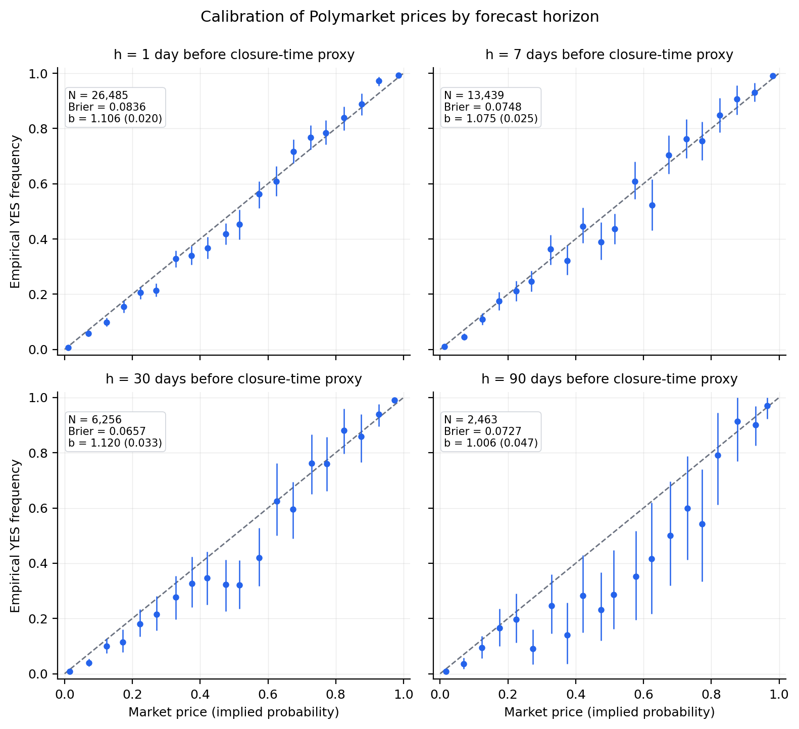
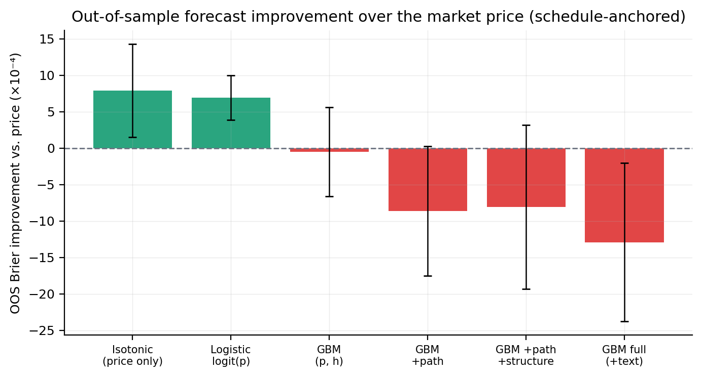

# Polymarket Forecasting & Market Efficiency

A research pipeline that evaluates prediction-market prices as probability
forecasts and tests whether recalibration or machine learning improves them.
It combines daily YES-token price histories from Polymarket's CLOB API with
market metadata from the Gamma API. The data are daily prices and metadata;
historical order-book depth and order flow are not used.

Two linked studies cover calibration, favorite–longshot bias, and transaction
costs, followed by a monthly walk-forward comparison of logistic recalibration,
isotonic regression, and LightGBM models with price, path, structure, and text
features.

## Research questions

1. Are Polymarket prices calibrated probability forecasts, and how does
   calibration change as the forecast horizon lengthens?
2. Do prices carry systematic biases, such as a favorite–longshot bias or a
   premium on the YES side?
3. Can simple strategies that trade against those biases make money after a
   1¢ per-contract trading cost?
4. Can recalibration or a machine-learning model beat the market price out of
   sample, and does trading on model–price disagreement survive costs?

## Pipeline

```text
01_fetch_markets   Gamma API market metadata
       |
       v
03_build_sample    binary, closed CLOB markets, volume >= $1,000
       |
       v
02_fetch_prices    CLOB API daily YES prices for the sampled markets
       |
       +--------------------------------+
       v                                v
Calibration study                    Forecast-model study
04_build_panel  market x horizon     08_features    snapshots for both anchorings,
                panel, 1-90 days,                   price-path and structure features
                two date anchorings  09_model       category and TF-IDF/SVD text features,
05_analysis     calibration, bias                   monthly walk-forward model ladder
                tests, backtests     10_interpret   diagnostics, divergence backtest
06_figures      figures/calibration/ 12_supplement  blends, mature folds
07_tables       markdown tables      11_figures2    figures/models/, tables
```

Each numbered script is one stage that reads saved outputs from earlier
stages, so a stage can be rerun on its own once its inputs exist.

## Results

The included results were regenerated on **1 October 2026** after correcting
forecast timing, event-size availability, tied-price calibration, and blend
tuning. They supersede the earlier saved estimates.

The sample contains 26,967 markets before price-history
screening and 26,508 with usable histories. Of these, 26,499
contribute 82,610 calibration observations across seven horizons from
1 to 90 days. The model feature dataset has 135,522 rows across both
date anchorings. Markets must be closed with binary YES/NO outcomes, have
scheduled end dates through 31 July 2025 and lifetime volume of at least $1,000.
The retrospective minimum-lifetime filter is 1.5 days from creation to closure.
Explicitly unresolved statuses (including proposed and disputed) are excluded.
The legacy `all_resolved_markets` key in the construction counts names the raw
closed-market input; the subsequent filters determine label eligibility.

### Calibration

Price log-odds calibration slopes range from 1.01 to
1.13. At seven days, the slope is
1.075
(event-clustered SE 0.025).
The CORP decomposition now pools tied prices before isotonic fitting and
matches sklearn's isotonic solution. Its identity is
`Brier = miscalibration - discrimination + uncertainty`.
The separate fixed-bin decomposition describes the binned forecasts; its
residual relative to the raw Brier score is recorded explicitly.



Calibration-error intervals resample entire events and recompute both mean
outcomes and mean prices. Closure dates are proxies, as explained below.

### Forecast models

The primary scheduled-end comparison has **55,826 evaluated observations,
25 test months and 6,021 event clusters**. These are
market–horizon observations, not distinct markets. Lower Brier scores are better.

| Forecast | Pooled Brier score |
| --- | ---: |
| Market price | 0.0785305 |
| Isotonic recalibration | 0.0777421 |
| Logistic recalibration | 0.0778376 |
| Full LightGBM | 0.0798224 |

Isotonic has the lowest pooled score in this comparison, a
1.00% reduction relative
to the price. Its event-clustered t is 2.42, while the
equal-month t is -0.32. Logistic reduces pooled error by
0.88%
(event t = 4.46; monthly t = 1.53).
The full GBM underperforms the price. These differences do not establish
consistent prospective forecast gains.

The split-sample GBM blend chooses weight 0.05 using
5,501 early predictions whose closure-time proxies precede the
2024-07 cutoff, then evaluates 49,405 later
predictions from disjoint events. Its improvement has event t =
4.93 and monthly t = 3.91.
The full-sample blend curves are descriptive, not tuning evidence.



Error bars above are 1.96 times event-clustered standard errors. Equal-month
inference answers a different question and is reported separately.

### Backtest design and limits

Calibration backtests buy YES at prices 90–99% or buy NO when YES costs 1–10%,
at 7- and 30-day closure-proxy horizons, plus a 30-day scheduled-end comparison.
The model backtest buys the side favored by the full GBM when its forecast
differs from the price by more than 2, 5 or 10 percentage points.

Each observation receives an equal monetary stake. Entry cost is price plus
1 cent per contract; the position is held to settlement. Buying NO costs
`1 - p + 0.01`. Return is payoff divided by entry cost minus one. A losing
trade loses the full stake; some winning outcomes merely break even after costs.
There is no compounding, capital budget, position cap or executable bid/ask model.
Repeated horizons and related markets can represent overlapping positions.

| Model disagreement threshold | Mean return after 1 cent | Event t | Monthly t |
| --- | ---: | ---: | ---: |
| 2 points | -5.10% | -3.21 | -1.81 |
| 5 points | 1.62% | 0.81 | 0.26 |
| 10 points | 7.53% | 2.20 | 0.81 |

These are price-based signal tests, not evidence of achievable portfolio returns.
Calibration backtests group monthly returns by closure-proxy month; model
backtests and forecast comparisons group by snapshot month. Cluster mean tests
use asymptotic CR0 errors. Monthly t statistics assume independent month means;
they are not adjusted for serial correlation. Model selection and multiple
comparisons on the same retrospective dataset remain limitations.

See the [calibration aggregates](results/analysis.json),
[model metrics and fold diagnostics](results/models/model_metrics.json),
[interpretation and backtests](results/models/interpretation.json), and
[supplementary comparisons](results/models/supplement.json).

## Run offline

Use Python 3.11:

```bash
python3.11 -m venv .venv
source .venv/bin/activate
python -m pip install -r requirements.txt
python -m unittest discover -s tests -v
python sample/run_sample.py
```

On Windows activate with `.venv\Scripts\Activate.ps1`. LightGBM may need
`libomp` on macOS. The sample runner creates a separate temporary project, runs
`00`, `03`, `04`, `05`, `06`, `07` and `08`, and reports its output path.
Use `--workdir DIR` to choose a new or empty directory. It preserves the included
results and generates all six calibration charts, even when long horizons have
too few observations. The bundled runner demonstrates early stages; its small
synthetic inputs are for software checks, not empirical research.

The tests cover malformed input, retries and interrupted resume, timing and
event availability, single-class fitting, tied-price calibration, uncertainty,
blend tuning, sample safety, and reconciliation of saved aggregates. They do not
recreate the historical model fits. Every script uses paths relative to its own
location, so relocated copies and execution from another directory are supported.

## Data and full reproduction

Only synthetic raw inputs, aggregate results and figures are included here.
Historical raw records, processed datasets and individual predictions are not
bundled. This folder alone cannot reproduce the historical estimates.
The synthetic sample has 293 invented metadata rows and 231 history records,
including intentionally failed, empty, single-print and gapped histories.
`python sample/make_sample.py` regenerates it deterministically.

For a historical rerun, supply `data/raw/markets_meta.jsonl` and
`data/raw/price_histories.jsonl` in a separate project copy, then run:

```bash
python code/00_setup.py
python code/03_build_sample.py
python code/04_build_panel.py
python code/05_analysis.py
python code/06_figures.py
python code/07_tables.py
python code/08_features.py
python code/09_model.py
python code/10_interpret.py
python code/12_supplement.py
python code/11_figures2.py
```

`12` must precede `11`, which reads its supplementary comparisons. Each stage
overwrites its generated outputs. The complete sequence was executed in a
fresh isolated environment using the pinned dependencies on 1 October 2026.
Random seeds are 42; numeric results can vary between library builds and platforms.
For efficient fitting, set `OPENBLAS_NUM_THREADS=1` and
`VECLIB_MAXIMUM_THREADS=1` before starting Python; LightGBM itself uses four threads.

For new collection, start with an empty `data/raw/` in another copy, run `00`,
then `01_fetch_markets.py`, `03_build_sample.py`, `02_fetch_prices.py`, and
continue from `04` above. Metadata collection requires `curl`. The price request
uses a token ID, `interval=max` and `fidelity=1440`, as described in the
[history API reference](https://docs.polymarket.com/api-reference/markets/get-prices-history).
The [market API reference](https://docs.polymarket.com/api-reference/markets/list-markets)
documents metadata and date filters.

The collectors validate responses, retry transient failures with a finite limit,
checkpoint completed metadata windows atomically, and retry previously failed
price requests on resume. Price failures exit with an error after preserving
completed work. Successful empty histories are skipped on resume. Interrupted
final JSONL fragments are preserved separately before append recovery; malformed
complete records and conflicting timestamps fail explicitly. Metadata pagination
splits crowded date windows and reports a failure if the window cannot be split
further. Successful saved IDs are retained rather than refreshed.

Bounded live smoke checks retrieved one Gamma market and one CLOB history on
1 October 2026. A complete new collection was not run. API coverage, pagination
behavior and metadata can change, so these checks do not prove universe completeness.

## Design and limits

- Forecast snapshots must be at or after market creation and strictly before
  `t_res`, the closure-time proxy (`closedTime`, with `endDate` fallback).
  This proxy does not independently establish outcome availability.
  Missing creation dates use the first observed quote as the snapshot lower
  bound; the metadata lifetime filter cannot exclude those unknown lifetimes.
- Labels require a closed market and terminal outcome prices of 0 and 1.
  An explicit resolution status must be `resolved`. Legacy missing statuses
  remain eligible under the closed/terminal-price rule; those labels and the
  metadata were not independently verified against historical oracle records.
  [Proposal and dispute are separate stages from final resolution](https://docs.polymarket.com/concepts/resolution).
- Prices and path features use only quotes at or before the snapshot, with a
  1.5-day staleness limit. Precreation and invalid quotes are excluded. Probabilities
  are clipped to `[0.001, 0.999]` for modelling and log-odds calculations.
- Event size counts sampled markets created by the snapshot; first observed
  quotes supply a fallback when creation is missing. Future-created siblings
  do not contribute. Lifetime volume and current liquidity are excluded as
  predictors, although lifetime volume still determines sample selection.
  Invalid scheduled lifetimes become missing features; positive lifetimes use
  the actual denominator, even for unusually short schedules or late closures.
- Monthly training requires both snapshot and closure proxy to precede the
  test month. Test events appearing in training are excluded. The first six
  observed snapshot months form burn-in; folds need at least 500 training rows.
- TF-IDF/SVD is fitted only on eligible burn-in data. Early stopping holds out
  entire events ordered by their latest training snapshot. Its selected tree
  count is then refitted on every eligible training row. Single-class cases
  use explicit binary probabilities or the fixed training budget.
- Blend tuning uses only closure proxies preceding its fixed cutoff, followed by
  evaluation on later rows from different events. Fold sizes and timestamp
  bounds are recorded in the model metrics; predictions retain snapshot times.
- Questions, scheduled dates, event membership and the resolved-market universe
  were collected retrospectively. These corrections remove identified timing
  violations but do not establish a fully point-in-time dataset. Closure-proxy
  anchoring is retrospective; scheduled-end anchoring also relies on historical
  metadata accuracy. This work does not establish prospective profitability.

## Files

```text
code/                 Collection, construction, analysis, models and charts
sample/               Invented inputs, generator and isolated runner
tests/                Unit regressions, sample workflow and aggregate checks
results/              Calibration aggregates and bins
results/models/       Model metrics, interpretation and supplementary results
figures/calibration/  Six calibration figures
figures/models/       Six model figures
requirements.txt      Python 3.11 dependency pins
LICENSE               MIT license for original code and documentation
```

## License

Original code and documentation use the [MIT License](LICENSE).
Third-party data remain subject to their respective terms.
